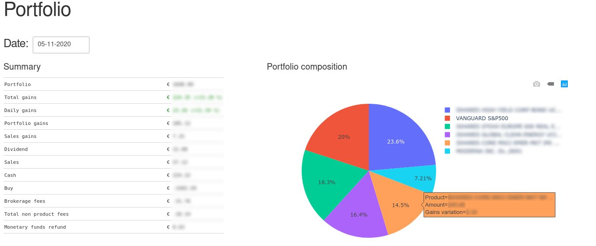
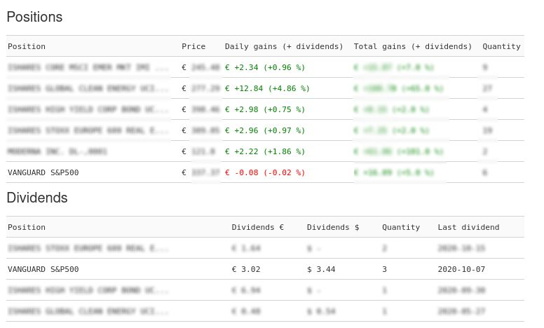
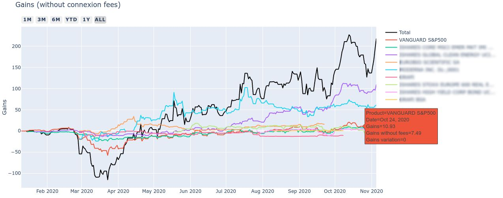
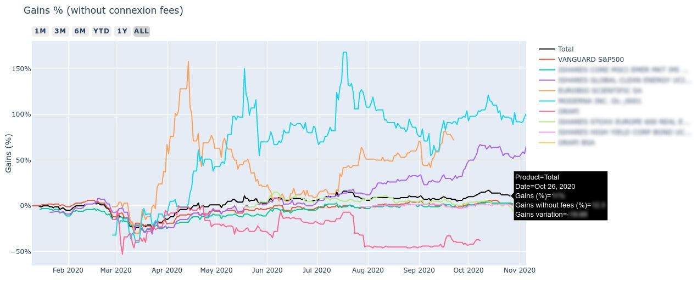
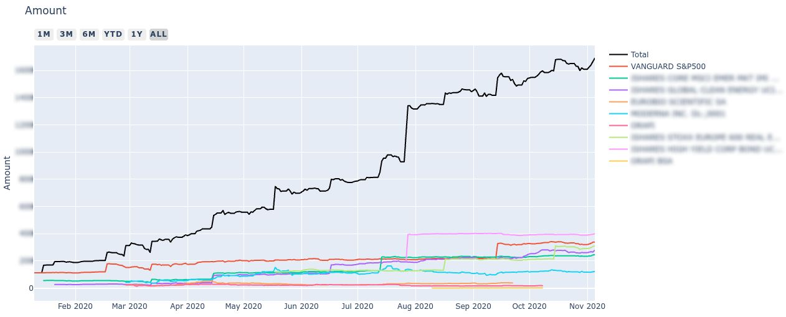
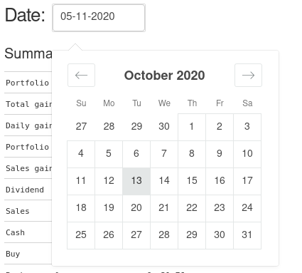

# Trading portfolio

This is an unofficial webapp for Degiro's trading platform. It allows you to track your portfolio's performance from day 1.







## Installation
First clone the project as follows:
```bash
git clone git@gitlab.utc.fr:bdebbabi/trading-portfolio.git
```  
You also have to install the required packages. You will have to run the following command:
```bash
pip install -r requirements.txt
```

Then you will need to add your authentification settings by modifying the ```settings.yaml``` file.
Add you username and password. If you have a 2-step authentification enabled in your Degiro account you have to add your authentification key, otherwise leave it empty. 
For more protection you can also write your authentification settings encoded into base64. You can use this [website](https://www.base64encode.org/) in order to do that. You will have to change ```HASHED``` to ```True``` in that case.
You also have to add the account creation date.
```YAML
AUTHENTIFICATION:
    USERNAME: my_username
    PASSWORD: my_password
    KEY: my_key
    HASHED: False
CREATION_DATE: '2020-01-09'
```

## Usage
This app is run on localhost. Use the following command to launch it:
```bash
python main.py
```
You can modify other settings in the yaml file depending on how you want to run the app.
```YAML
DEBUG: False
LIVE: True
MOBILE: False
```
You can specify the path of the settings.yaml file with this option ```--settings='path/to/settings.yaml'```
You can change thet date using the datepicker to see your portfolio on a specific date.
  


